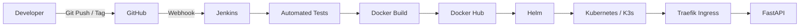

# DevOps Lab API

A lightweight FastAPI application built to demonstrate a complete CI/CD workflow using Jenkins, Docker, Helm and Kubernetes.

This project is part of a hands-on DevOps lab and works together with the [kubernetes-production-lab](https://github.com/HarunSert/kubernetes-production-lab) repository.

## Architecture



## Features

- FastAPI REST API
- Multi-stage Docker build
- Non-root runtime container
- Automated Pytest tests
- GitHub Webhook integration
- Jenkins CI/CD pipeline
- Semantic version based releases
- Docker Hub image publishing
- Helm based Kubernetes deployment
- Kubernetes rolling updates
- Liveness and readiness probes
- Horizontal Pod Autoscaler support
- Prometheus compatible metrics
- CPU load generation for HPA testing

## API Endpoints

| Endpoint | Purpose |
|---|---|
| `/` | Application information |
| `/health/live` | Kubernetes liveness probe |
| `/health/ready` | Kubernetes readiness probe |
| `/version` | Running application version |
| `/config` | Application environment information |
| `/load?seconds=N` | Generates CPU load for HPA testing |
| `/metrics` | Prometheus metrics |

## CI/CD Flow

Normal branch pushes trigger Jenkins without publishing a release.

Release deployment is triggered by a semantic Git tag.

```text
Git Tag
   |
   v
GitHub Webhook
   |
   v
Jenkins
   |
   +--> Automated Tests
   |
   +--> Docker Build
   |
   +--> Docker Hub Push
   |
   +--> Helm Upgrade
   |
   +--> Kubernetes Rolling Deployment
   |
   v
Deployment Verification
```

The Git tag is used as the Docker image and application version.

Example:

```text
Git Tag      : 1.0.2
Docker Image : harunsert/devops-lab-api:1.0.2
APP_VERSION  : 1.0.2
```

## Jenkins Pipeline

The release pipeline contains the following stages:

```text
Get Release Version
Run Tests
Build Docker Image
Push Docker Image
Get Deployment Repository
Deploy with Helm
Verify Deployment
```

Release tags use semantic versioning:

```text
MAJOR.MINOR.PATCH
```

Example release:

```bash
git tag 1.0.2
git push origin 1.0.2
```

The GitHub webhook automatically triggers Jenkins after the tag is pushed.

## Automated Tests

Tests are executed inside the Docker build before the release image is created.

Current API tests:

```text
test_root
test_liveness
test_readiness
test_version
```

Example successful execution:

```text
tests/test_api.py::test_root PASSED
tests/test_api.py::test_liveness PASSED
tests/test_api.py::test_readiness PASSED
tests/test_api.py::test_version PASSED

4 passed
```

If the tests fail, the release pipeline stops before the Docker image is published or deployed.

## Docker

Build the runtime image:

```bash
docker build \
  --target runtime \
  -t harunsert/devops-lab-api:local .
```

Run locally:

```bash
docker run --rm \
  -p 18080:8080 \
  -e APP_NAME=devops-lab-api \
  -e APP_ENV=local \
  -e APP_VERSION=local \
  harunsert/devops-lab-api:local
```

Test:

```bash
curl http://127.0.0.1:18080/
```

## Kubernetes Deployment

Kubernetes and Helm configuration is maintained in:

[HarunSert/kubernetes-production-lab](https://github.com/HarunSert/kubernetes-production-lab)

The application deployment includes:

- 2 application replicas
- Resource requests and limits
- Liveness probe
- Readiness probe
- Rolling update strategy
- Horizontal Pod Autoscaler
- ClusterIP Service
- Traefik Ingress
- ConfigMap based configuration

Current HPA configuration:

```text
Minimum replicas : 2
Maximum replicas : 5
CPU target       : 50%
```

## Tested Release

Release `1.0.2` was successfully deployed through the complete automated pipeline.

```text
Git Tag        : 1.0.2
Docker Image   : harunsert/devops-lab-api:1.0.2
Helm Revision  : 2
Replica Count  : 2
HPA Range      : 2-5
Health Check   : Ready
```

The running Kubernetes deployment was verified with:

```bash
kubectl get deployment devops-lab-api \
  -n devops-lab \
  -o jsonpath='{.spec.template.spec.containers[0].image}{"\n"}'
```

Result:

```text
harunsert/devops-lab-api:1.0.2
```

Application response:

```json
{
  "application": "devops-lab-api",
  "environment": "lab",
  "version": "1.0.2",
  "status": "running",
  "message": "DevOps CI/CD pipeline is running"
}
```

## Repository Structure

```text
.
├── app/
│   ├── __init__.py
│   └── main.py
├── tests/
│   └── test_api.py
├── Dockerfile
├── Jenkinsfile
├── requirements.txt
├── build.sh
├── docker_run.sh
└── README.md
```

## Purpose

This repository is a hands-on DevOps portfolio project designed to demonstrate practical experience with:

- CI/CD automation
- Docker containerization
- Automated testing
- Release versioning
- Kubernetes deployments
- Helm
- Rolling updates
- Health checks
- Horizontal scaling

The environment is intended to reproduce real-world DevOps deployment practices in a controlled lab environment.

## Author

**Harun Sert**

- GitHub: [HarunSert](https://github.com/HarunSert)
- LinkedIn: [Harun Sert](https://www.linkedin.com/in/harun-sert-819236233/)

